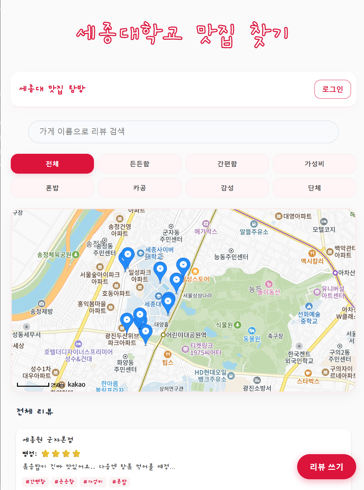
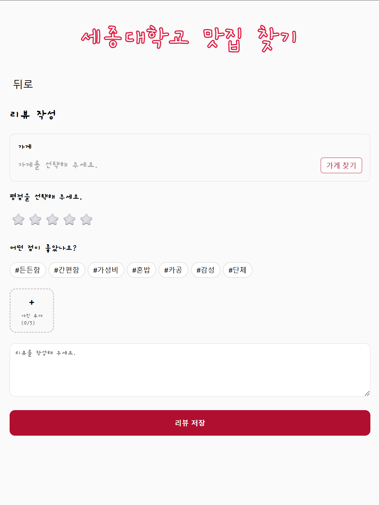

# 세종대학교 맛집 찾기

세종대 학우들과 백성들을 위한 지도 기반 맛집 리뷰 및 큐레이션 서비스입니다.
원하는 상황(가성비, 혼밥, 카공 등)에 맞는 맛집을 지도상에서 직관적으로 탐색하고, 자신만의 생생한 리뷰를 남길 수 있습니다.

**🔗 [Live Demo 보러가기](https://opensource-316fc.web.app/)**
| 기본 화면 | 리뷰작성 화면 |
| :---: | :---: |
|  |  |

---

## Tech Stack

- **Frontend**: React, React-Router-DOM
- **Backend/BaaS**: Firebase (Authentication, Firestore, Hosting)
- **Map API**: Naver Maps API v3

---

## Key Features & Technical Details

### 1. 인증 및 회원 관리 (Firebase Auth)

- **로그인 및 라우팅 제어**: `signInWithEmailAndPassword`로 인증된 사용자만 메인 페이지로 진입하여 리뷰 작성 권한을 가지도록 라우팅을 제어합니다. 비회원 유저를 위해 '로그인 하지 않고 지도 보기' 버튼을 제공하여 게스트 모드로 서비스 접근성을 높였습니다.
- **상세 에러 핸들링**: Firebase 에러 코드를 분석하여 유저에게 친절한 예외 피드백을 제공합니다. 계정 정보 불일치(`user-not-found`, `wrong-password`, `invalid-credential`) 및 이메일 형식 오류(`invalid-email`) 등을 세밀하게 분기 처리하였습니다.
- **가입 유효성 및 데이터 정합성**: 회원가입 즉시 `updateProfile`과 `user.reload()`를 실행하여, 유저 데이터의 정합성을 보장하고 즉각적인 UI 반영을 이끌어냈습니다.

### 2. 가게 검색 모달

- **동적 상태 제어**: 부모 컴포넌트로부터 `isOpen`, `onClose` 상태를 Props로 전달받아 모달창의 개폐를 유연하고 독립적으로 제어합니다.
- **UX 최적화 및 중복 요청 방지**: API 검색이 진행 중일 때는 찾기 버튼을 비활성화(`disabled={isSearching}`)하고 안내 문구를 변경하여, 유저의 중복 클릭 및 연타로 인한 불필요한 서버 과부하를 원천 차단했습니다.

### 3. 리뷰 작성/수정 및 데이터 최적화 (Custom Hook: `useReviewSubmit`)

- **본인 리뷰 권한 검증**: 유저 UID(`auth.currentUser?.uid`)를 대조하여, 로그인한 본인이 작성한 리뷰만 수정 및 삭제할 수 있도록 제한함으로써 데이터 보안과 무결성을 강화했습니다.
- **수정 모드 데이터 바인딩**: `useEffect`를 활용해 수정 모드 진입 시 기존 리뷰 데이터(가게 정보, 평점, 태그, 본문 텍스트, 이미지)를 비동기로 불러와 폼 전체에 자동으로 채워지도록 구현하여 사용자 편의를 극대화했습니다.
- **이미지 업로드 개수 제한**: 사진 첨부 시 최대 5장까지만 등록할 수 있도록 엄격한 클라이언트 측 유효성 검사를 적용하여 스토리지 리소스를 효율적으로 관리합니다.
- **가게 데이터 중복 등록 방지 (DB 최적화)**: 리뷰 작성 시, 해당 가게가 이미 데이터베이스(`places` 컬렉션)에 등록된 곳인지 1차 쿼리로 우선 조회합니다. 이미 존재하는 가게라면 새로 문서를 생성하지 않고 패스하며, 처음 등록되는 가게일 때만 새로 추가(`addDoc`)하도록 설계하여 똑같은 가게 데이터가 무분별하게 중복 적재되는 것을 완벽히 방지했습니다.

---

## 🚀 Getting Started

이 프로젝트는 [Create React App](https://github.com/facebook/create-react-app)으로 부트스트랩 되었습니다.

### Prerequisites

로컬 환경에서 프로젝트를 실행하기 위해 필요한 패키지를 설치합니다.

    npm install

### Available Scripts

프로젝트 디렉토리 내에서 다음 명령어들을 사용할 수 있습니다:

`npm start`
개발 모드에서 앱을 실행합니다.

http://localhost:3000을 열어 브라우저에서 확인할 수 있습니다. 코드를 수정하면 페이지가 자동으로 새로고침됩니다.

`npm run build`
프로덕션 환경을 위해 앱을 build 폴더에 빌드합니다.
